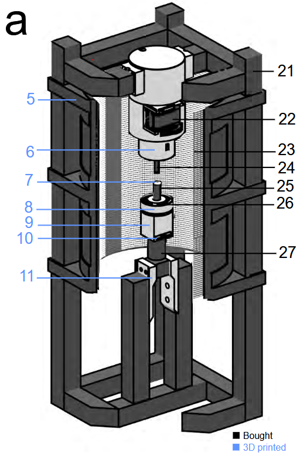

# Fly_VR
The aim of the project is to observe flies' behavior in an environment. We have a 360 degrees screen
which displays an environment created from Unity, a game engine.

The fly is fixed on a saphire, it can turns on itself and flap its wings. A camera is taking
pictures of the fly, detect its direction, wings. Then, Unity recover camera’s data and integrate them
to the simulation

You can find opencv library on : https://opencv.org/releases/
I use the 4.10.0 version.

You will also need library from spinnaker, download the file : https://www.teledynevisionsolutions.com/products/spinnaker-sdk/?model=Spinnaker%20SDK&vertical=machine%20vision&segment=iis

To import correctly the project and libraries, follow instruction from the pdf Travail JB janvier 2025

Here is the code :
C_chill = Code in C++, connect to camera, analyse image, displays image, save resutls as heading frame rate in csv file
camera_acquisition = Creation of a DLL from C++ C_chill, connect to camera, analyse image, displays image, save resutls as heading frame rate in csv file, send this results via callback
Camera_unity_C_sharp = Proposition of interface between DLL and C#
Acquisitiond_v143 = Executable from the C++ C_chill
3 DLL libraries camera_acquisition_ = use the standard one for normal use. You can also find debug and print and no image DLL.

